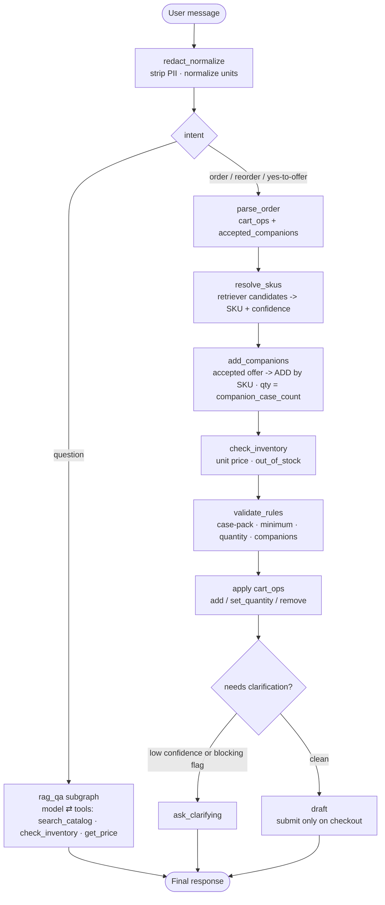

# AI Order Desk

An agent for a restaurant-supply distributor. It turns a messy natural-language
order — *"need 3 cases of 16oz deli containers and some salsa cups"* — into a
clean, structured, supplier-split draft cart, building that cart **iteratively
across turns** and **asking for clarification only when it's genuinely unsure**.

Built with **LangGraph** (state + control flow), **LangChain** (model calls,
tools, RAG), local **FAISS + sentence-transformers** retrieval, **Gemini** for
the LLM nodes, and **LangSmith** for tracing + evals.

## The two things it's trying to demonstrate

1. **Ask only when unsure.** A confidence gate proceeds autonomously on a clean
   order and asks a clarifying question *only* when an item is low-confidence or
   carries a blocking flag (ambiguous size, missing quantity, needs a companion
   add-on, below minimum, out of stock). When it
   asks, it enumerates the real options ("did you mean 8oz, 16oz, or 32oz?").
2. **An iterative, context-aware cart.** You add to, change quantities in, and
   remove from a running cart across turns, and can interleave product questions
   mid-build without losing cart state.

---

## Quickstart

Requires Python ≥ 3.11. **Three lines to a running app** — no `uv`, no `make`,
just Python:

```bash
python run.py setup     # create .venv + install the runtime (torch, faiss, gradio, …)
cp .env.example .env    # add your GOOGLE_API_KEY
python run.py ui        # launch the Gradio order desk
```

### Pick any toolchain — they're interchangeable

`run.py` (pip), `uv`, and `make` run the same code with the same dependencies
(`requirements.txt` is generated from `uv.lock`, so the pip path never drifts):

| Task | just Python — `run.py` | [uv](https://docs.astral.sh/uv/) | make |
| --- | --- | --- | --- |
| Install the app | `python run.py setup` | `uv sync --extra agent` | `make setup-agent` |
| + test/lint tools | `python run.py setup-dev` | `uv sync --extra agent` | `make setup-agent` |
| Launch the UI | `python run.py ui` | `uv run python -m src.interfaces.gradio_app` | `make ui` |
| Run the tests | `python run.py test` | `uv run pytest` | `make test` |
| Lint | `python run.py lint` | `uv run ruff check .` | `make lint` |

> **No uv?** Use the `run.py` column (or plain `pip install -r requirements.txt`).
> `make` is a thin wrapper over `uv`, so it needs `uv` installed.
> Already in a virtualenv/conda env? `run.py` installs into it instead of `.venv`.

### Keys & the keyless core

The deterministic core (parsing, cart math, the clarify gate, SKU resolution) is
fully testable **without any API key**. With uv, `make setup && make test` installs
just the lightweight core + test tooling and runs the suite keyless. The full app
(LLM + RAG + UI) needs `GOOGLE_API_KEY`; the eval judge also needs `OPENAI_API_KEY`.

```bash
python run.py eval               # score the agent over the dataset (needs keys)
uv run python scripts/smoke.py   # drive a scripted multi-turn conversation in the terminal
```

First UI run downloads the local embedding model (~90 MB) and builds the FAISS
index in-process. The Gemini free tier is 5 req/min — `GEMINI_RPM` self-throttles
to stay under quota; raise it on a paid tier for a snappier UI.

### Fully isolated check (Docker)

To set up and run the suite in a clean OS-level sandbox (mirrors CI — `ruff` + the
keyless suite, no keys needed):

```bash
docker build -t wholesale-agent-test .
docker run --rm wholesale-agent-test
```

First run downloads the local embedding model (~90 MB) and builds the FAISS
index in-process. The Gemini free tier is 5 req/min — `GEMINI_RPM` self-throttles
to stay under quota; raise it on a paid tier for a snappier UI.

---

## The graph



`redact_normalize` runs first, as a front-door guardrail, so PII never reaches
the LLM or the trace. Deterministic nodes are pure functions; `intent`,
`parse_order`, and the `rag_qa` subgraph are the only LLM calls. `rag_qa` is a real
**tool-calling loop** (`bind_tools` → `ToolNode` → `ToolMessage`): the model decides
which read-only tool to call — `search_catalog` over the FAISS catalog,
`check_inventory` / `get_price` over the supplier — and loops until it answers. It's
compiled as its own subgraph and embedded as a single node, so the root graph stays a
linear pipeline (and `parent.stream(subgraphs=True)` can stream the answer tokens).

**Companion add-ons (upsell) are data-driven, coverage-based, and the loop is the
conversation.** A catalog item names its pairings via `companion_skus` (e.g. a deli
container → its lid), so `validate_rules` raises a generic `NEEDS_COMPANION` and the
gate asks "needs matching X — should I add them?". The offer is **coverage-based**:
a lid (one SKU fits all deli sizes) is pending whenever the cases in the cart don't
cover the *summed units* of every deli line it pairs with — so adding a second size
re-offers a top-up. The reply is parsed as a *closed-set selection*
(`accepted_companions`), and `add_companions` `SET_QUANTITY`s the lid to the exact
aggregate total (`companion_case_count` over all deli lines), never re-resolved from
free text. So add → offer → accept → offer-the-next continues across turns until a
turn needs no question and the gate drafts. Adding a pairing is a catalog edit, not code.

**Draft vs. place order.** A clean turn builds a *running draft* and never auto-submits
— it asks "anything else, or should I place the order?". `submit_order` fires only when
the user explicitly checks out ("that's it" → `parse_order` sets `place_order`), so
ordering one item at a time can't produce a string of premature confirmations.

---

## Architecture (ports & adapters)

```
src/
  domain/        Pydantic models + StrEnums and the pure business logic
                 (redaction, rules, cart aggregate, SKU resolution, policies).
                 Zero LLM/LangChain imports.
  ports/         Protocols for the external systems with no LangChain equivalent:
                 CatalogRepository (RAG seam), OrderAgent (inner-agent contract).
  adapters/      Concrete implementations — JsonCatalogRepository, FaissCatalogRepository.
  app/
    turn.py      handle_turn — the UX boundary the UI delegates to.
    graph/       OrderState, the deterministic + LLM nodes, the gate, build_graph,
                 and subgraphs/ (the QA tool-calling agent + its read-only tools).
  interfaces/    Gradio UI (a thin mirror of graph state).
  bootstrap.py   Composition root — the only place that wires concrete adapters + models.
evals/           Dataset, deterministic judges + the GPT-4o answer judge, run_eval.
```

The dependency rule is one-directional: `app → domain`, adapters → ports, and
**domain imports nothing upward**. `bootstrap.py` is the only module that knows
every concrete adapter.

---

## Design notes (what I chose, and why)

- **LangChain's base classes *are* the ports for the AI plumbing.** `BaseChatModel`
  / `Embeddings` / `VectorStore` are already provider-agnostic seams (and carry
  LangSmith tracing). Re-wrapping them in custom Protocols would only lose
  `with_structured_output` / `bind_tools` and break tracing. Custom ports exist
  *only* where LangChain has no concept — the catalog repository and the inner
  agent.

- **Tools are model-driven only where it's safe: the read-only question path.** The
  catalog/supplier lookups are real LangChain `StructuredTool`s, and the QUESTION branch
  is a genuine tool-calling agent (`bind_tools` + `ToolNode`), not a single canned RAG
  call. The **order-write** path is deliberately *not* tool-driven: SKU resolution, the
  clarify/draft gate, and `submit_order` stay deterministic typed calls, so the model can
  answer questions but can never silently place or mutate an order. The tools and the
  deterministic nodes share the same adapters underneath — a tool is just the model-facing
  face of a port.

- **Catalog (RAG) vs. supplier API — static vs. dynamic.** The catalog is the
  semantic knowledge base (names, aliases, case packs, companions) and lives in the
  vector store. **Price and stock are deliberately *not* in it** — those are
  dynamic and would belong behind a (mocked) supplier API, fetched at runtime.
  Baking constantly-changing prices into a RAG corpus is the wrong shape.

- **The gate is the centerpiece, and it's deterministic.** "Ask only when unsure"
  is a pure function over the turn's items (confidence threshold + a blocking-flag
  set). That makes the thesis behavior unit-tested *and* eval-measured, not a
  prompt we hope holds.

- **The cart is an aggregate; all mutation goes through it.** `Cart.apply(ops)` is
  pure and returns a new cart; the LLM only emits `cart_ops` (add / set_quantity /
  remove) — it never mutates the cart directly, and neither do UI callbacks. That
  keeps the UI a swappable thin mirror.

- **PII: secure field for *needed* data, redaction for *accidental* leakage.**
  Nothing about placing an order needs a phone/email, so when one shows up in chat
  it's accidental — `redact_normalize` strips it at the front door before the LLM
  or trace sees it (recording only the *type*, never the value). If we ever need
  delivery contact, it belongs in a structured UI field that bypasses the prompt
  entirely — not in the chat.

- **Cross-model eval judge.** The deterministic metrics are graded with `==`; the
  open-ended RAG answer is graded by **GPT-4o judging the Gemini agent**, so the
  model never grades its own work and we avoid self-preference bias.

---

## Testing approach (and the unit-vs-eval line)

The split is deliberate — deterministic behavior is pinned by fast tests;
probabilistic behavior is measured by the eval, never asserted in a unit test.

| Layer | What | How |
|---|---|---|
| **Unit** | pure functions (`redact_normalize`, `validate_rules`, `Cart`, `gate`, `resolve_skus`, judges) | exact assertions, keyless |
| **Contract** | LLM nodes (`intent`, `parse_order`, `rag_qa`) | fake model — assert **state shape & routing**, not exact text |
| **Integration** | graph wiring + FAISS retriever | fake LLM / real embeddings — clean→drafted, ambiguous→clarify, question→answer + cart unchanged |
| **Eval** | end-to-end quality | LangSmith dataset + the two metrics (marked `@pytest.mark.eval`, skipped by default) |

`make test` runs the first three (≈150 tests, fast, keyless). The code was built
test-first; the commit history follows that order.

---

## Eval

`uv run python -m evals.run_eval` scores `evals/datasets/order_desk.jsonl` on:

1. **Extraction correctness** — right SKUs/quantities/cart-ops (deterministic).
2. **Clarification behavior** — asked exactly when it should (deterministic; the thesis metric).
3. **Order submission** — drafts vs. places exactly when the user checks out, never
   auto-confirming a running draft (deterministic; rows `draft_not_placed`,
   `place_order_on_checkout`, `place_existing_draft`).
4. **Answer faithfulness** — RAG answers grounded in the catalog (GPT-4o judge; needs `OPENAI_API_KEY`).

A representative run: **extraction 92%, clarification 83%, answer faithfulness
100%**. The only failures are the two documented deferred features below
(`out_of_stock`, `reorder_usual`) — the eval surfacing them is the point, not a
number to game; the dataset's expectations are never relaxed to pass.

`make eval` runs that local, keyless-friendly runner. `make eval-langsmith`
(`uv run python -m evals.langsmith_eval`) is its in-platform sibling: it **syncs** the
JSONL into a LangSmith **Dataset** (`order-desk` — examples keyed by a deterministic id,
so a run creates missing rows and updates changed ones rather than drifting) and runs
`langsmith.evaluate()` over the **same** `evals/judges.py` metrics, so experiments are
versioned and comparable (model-vs-model, per-row) in the UI without the two paths ever
drifting. Needs `LANGSMITH_API_KEY`.

---

## What I'd improve with more time

- **Inventory / out-of-stock** — wire a mocked `SupplierGateway` (price + stock)
  so the `out_of_stock` flag and lead-time messaging fire. (The flag and gate
  handling already exist; only the data source is stubbed out.)
- **Reorder / item-memory** — populate per-restaurant memory so "the usual"
  resolves.
- **`interrupt()`/resume** — conversation state now lives in a LangGraph
  **checkpointer** (the agent records each turn, keyed by thread id; the UI no longer
  threads history), and the cart is the UI's directly-editable document. The remaining
  production step is `interrupt()`/resume for a mid-turn approval gate (e.g. confirming
  a high-value order) — a better fit than re-running clarification turns.
- **`set_quantity` robustness** — "make it 3" now classifies correctly, but it's
  LLM-dependent; a few-shot example in the parse prompt would harden it against
  regressions (the eval is what would catch one).
- **Multi-supplier** — the cart and catalog are supplier-keyed from day one;
  Stage 2 is "add catalog rows + a supplier adapter," not a graph rewrite.

---

## Observability

Tracing is **wired in code**, not just left to ambient env vars:
`observability.configure_tracing(settings)` applies the `LANGSMITH_*` settings at each
entry point (so the `Settings` fields are the single source of truth and the toggle is
logged on startup). With `LANGSMITH_TRACING=true` + `LANGSMITH_API_KEY`, every turn
traces to `LANGSMITH_PROJECT`.

Each run is **labeled at creation** from the one boundary (`LangGraphOrderAgent.run`),
so the nodes stay pure and there's no extra round-trip:

- **run name** `order_desk_{surface}` and tag `surface:{ui|eval|smoke}`, set via the
  invoke `RunnableConfig` — conflict-free because it's part of the run's create payload;
- the **eval-row id** on eval runs (find any dataset row in the UI) as run metadata.

The turn's **outcome** (`intent`, `status`, `clarifications`, `confirmation`) isn't
re-attached as metadata — it's already the run's **outputs** (they're keys in the graph's
final state), so the trace shows it for free. (Patching it back on post-hoc would race
the background tracer — a 409 — and block on the network, so we don't.) In the trace tree
you also see the gate's `clarify`-vs-`draft` branch, the `pii_found` guardrail firing,
and `cart_ops → draft_cart` showing the per-turn mutation.

Logging is complementary to tracing, not replaced by it: tracing is optional and remote,
so a failed turn (LLM error, rate limit, malformed output) is logged at the agent
boundary as an always-on signal, then re-raised. `configure_logging()` holds the root
(and all third-party libraries) at `WARNING` and raises only this app's loggers to
`INFO`, so a healthy production turn emits nothing — only the startup line and real
errors surface.