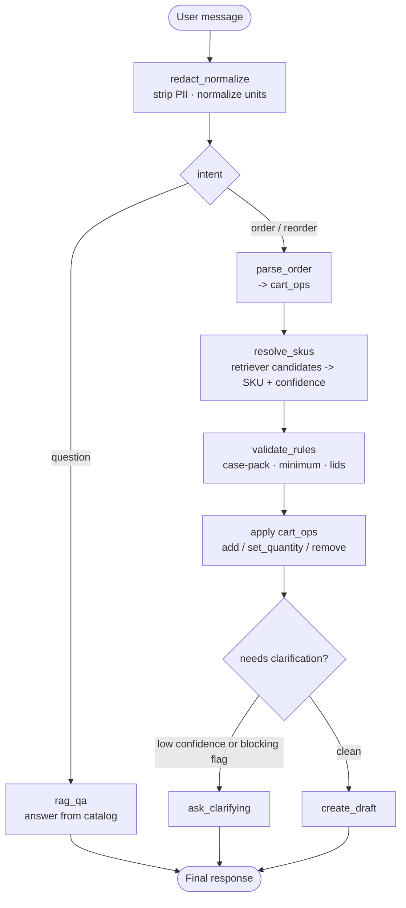

# AI Order Desk

An agent for a restaurant-supply distributor. It turns a messy natural-language
order — *"need 3 cases of 16oz deli containers and some salsa cups"* — into a
clean, structured, supplier-split draft cart, building that cart **iteratively
across turns** and **asking for clarification only when it's genuinely unsure**.

Built with **LangGraph** (state + control flow), **LangChain** (model calls,
tools, RAG), local **FAISS + sentence-transformers** retrieval, **Gemini** for
the LLM nodes, and **LangSmith** for tracing + evals.

## The two things it's trying to demonstrate

1. **Ask only when unsure.** A confidence gate proceeds autonomously on a clean
   order and asks a clarifying question *only* when an item is low-confidence or
   carries a blocking flag (ambiguous size, needs lids, below minimum). When it
   asks, it enumerates the real options ("did you mean 8oz, 16oz, or 32oz?").
2. **An iterative, context-aware cart.** You add to, change quantities in, and
   remove from a running cart across turns, and can interleave product questions
   mid-build without losing cart state.

---

## Quickstart

Requires [uv](https://docs.astral.sh/uv/) and Python ≥ 3.11.

```bash
make setup        # core + dev deps only — fast, no API key, runs the test suite
make test         # unit + contract + integration tests (evals skipped by default)
make lint
```

The deterministic core (parsing rules, cart math, the gate, SKU resolution) is
fully testable **keyless** — `make setup && make test` needs no API keys.

To run the agent (LLM + RAG + UI), install the heavier group and add keys:

```bash
make setup-agent           # langgraph, langchain, faiss, sentence-transformers, gradio, …
cp .env.example .env       # then fill in GOOGLE_API_KEY (and OPENAI_API_KEY for the eval judge)
```

### Run it

```bash
make ui                          # Gradio chat + cart panel  (needs GOOGLE_API_KEY)
uv run python scripts/smoke.py   # drive a scripted multi-turn conversation in the terminal
uv run python -m evals.run_eval  # score the agent over the dataset (the two metrics + LLM judge)
```

First run downloads the local embedding model (~90 MB) and builds the FAISS
index in-process. The Gemini free tier is 5 req/min — `GEMINI_RPM` self-throttles
to stay under quota; raise it on a paid tier for a snappier UI.

---

## The graph



`redact_normalize` runs first, as a front-door guardrail, so PII never reaches
the LLM or the trace. Deterministic nodes are pure functions; `intent`,
`parse_order`, and `rag_qa` are the only LLM calls.

---

## Architecture (ports & adapters)

```
src/
  domain/        Pydantic models + StrEnums and the pure business logic
                 (redaction, rules, cart aggregate, SKU resolution, policies).
                 Zero LLM/LangChain imports.
  ports/         Protocols for the external systems with no LangChain equivalent:
                 CatalogRepository (RAG seam), OrderAgent (inner-agent contract).
  adapters/      Concrete implementations — JsonCatalogRepository, FaissCatalogRepository.
  app/
    turn.py      handle_turn — the UX boundary the UI delegates to.
    graph/       OrderState, the deterministic + LLM nodes, the gate, and build_graph.
  interfaces/    Gradio UI (a thin mirror of graph state).
  bootstrap.py   Composition root — the only place that wires concrete adapters + models.
evals/           Dataset, deterministic judges + the GPT-4o answer judge, run_eval.
```

The dependency rule is one-directional: `app → domain`, adapters → ports, and
**domain imports nothing upward**. `bootstrap.py` is the only module that knows
every concrete adapter.

---

## Design notes (what I chose, and why)

- **LangChain's base classes *are* the ports for the AI plumbing.** `BaseChatModel`
  / `Embeddings` / `VectorStore` are already provider-agnostic seams (and carry
  LangSmith tracing). Re-wrapping them in custom Protocols would only lose
  `with_structured_output` / `bind_tools` and break tracing. Custom ports exist
  *only* where LangChain has no concept — the catalog repository and the inner
  agent.

- **Catalog (RAG) vs. supplier API — static vs. dynamic.** The catalog is the
  semantic knowledge base (names, aliases, case packs, lids) and lives in the
  vector store. **Price and stock are deliberately *not* in it** — those are
  dynamic and would belong behind a (mocked) supplier API, fetched at runtime.
  Baking constantly-changing prices into a RAG corpus is the wrong shape.

- **The gate is the centerpiece, and it's deterministic.** "Ask only when unsure"
  is a pure function over the turn's items (confidence threshold + a blocking-flag
  set). That makes the thesis behavior unit-tested *and* eval-measured, not a
  prompt we hope holds.

- **The cart is an aggregate; all mutation goes through it.** `Cart.apply(ops)` is
  pure and returns a new cart; the LLM only emits `cart_ops` (add / set_quantity /
  remove) — it never mutates the cart directly, and neither do UI callbacks. That
  keeps the UI a swappable thin mirror.

- **PII: secure field for *needed* data, redaction for *accidental* leakage.**
  Nothing about placing an order needs a phone/email, so when one shows up in chat
  it's accidental — `redact_normalize` strips it at the front door before the LLM
  or trace sees it (recording only the *type*, never the value). If we ever need
  delivery contact, it belongs in a structured UI field that bypasses the prompt
  entirely — not in the chat.

- **Cross-model eval judge.** The deterministic metrics are graded with `==`; the
  open-ended RAG answer is graded by **GPT-4o judging the Gemini agent**, so the
  model never grades its own work and we avoid self-preference bias.

---

## Testing approach (and the unit-vs-eval line)

The split is deliberate — deterministic behavior is pinned by fast tests;
probabilistic behavior is measured by the eval, never asserted in a unit test.

| Layer | What | How |
|---|---|---|
| **Unit** | pure functions (`redact_normalize`, `validate_rules`, `Cart`, `gate`, `resolve_skus`, judges) | exact assertions, keyless |
| **Contract** | LLM nodes (`intent`, `parse_order`, `rag_qa`) | fake model — assert **state shape & routing**, not exact text |
| **Integration** | graph wiring + FAISS retriever | fake LLM / real embeddings — clean→drafted, ambiguous→clarify, question→answer + cart unchanged |
| **Eval** | end-to-end quality | LangSmith dataset + the two metrics (marked `@pytest.mark.eval`, skipped by default) |

`make test` runs the first three (≈150 tests, fast, keyless). The code was built
test-first; the commit history follows that order.

---

## Eval

`uv run python -m evals.run_eval` scores `evals/datasets/order_desk.jsonl` on:

1. **Extraction correctness** — right SKUs/quantities/cart-ops (deterministic).
2. **Clarification behavior** — asked exactly when it should (deterministic; the thesis metric).
3. **Answer faithfulness** — RAG answers grounded in the catalog (GPT-4o judge; needs `OPENAI_API_KEY`).

A representative run: **extraction 83%, clarification 75%, answer faithfulness
100%**, with the failures being the documented gaps below — the eval surfacing
them is the point.

---

## What I'd improve with more time

- **Inventory / out-of-stock** — wire a mocked `SupplierGateway` (price + stock)
  so the `out_of_stock` flag and lead-time messaging fire. (The flag and gate
  handling already exist; only the data source is stubbed out.)
- **Reorder / item-memory** — populate per-restaurant memory so "the usual"
  resolves.
- **Multi-turn resume** — today the graph is single-turn and the UI passes recent
  chat history into the prompt so follow-ups ("yes, 16oz") have context. The
  production version is a LangGraph **checkpointer + `interrupt()`/resume** keyed
  by thread id.
- **`set_quantity` robustness** — "make it 3" is occasionally classified by the
  model as `add`; this is parse-prompt tuning (few-shot) rather than a wiring bug.
- **Streaming** — stream tokens/steps to the UI via `graph.stream`.
- **Multi-supplier** — the cart and catalog are supplier-keyed from day one;
  Stage 2 is "add catalog rows + a supplier adapter," not a graph rewrite.

---

## Observability

With `LANGSMITH_TRACING=true` + `LANGSMITH_API_KEY`, every turn traces to the
`LANGSMITH_PROJECT`. In the trace tree you can see the `gate` decision, the
`pii_found` guardrail firing, and `cart_ops → draft_cart` showing the per-turn
mutation.